# PDF Chat Application

A Streamlit-based application that allows users to upload multiple PDF documents and have interactive conversations with their content using Google's Gemini AI.

## Features

- 📚 **Multiple PDF Support**: Upload and process multiple PDF files simultaneously
- 💬 **Interactive Chat**: Ask questions about your documents and get intelligent responses
- 🧠 **Memory**: Maintains conversation history for context-aware responses
- ⚡ **Fast Processing**: Efficient text chunking and vector storage for quick retrieval
- 🎨 **Clean UI**: User-friendly Streamlit interface with custom styling

## Prerequisites

- Python 3.7 or higher
- Google API key for Gemini AI

## Installation

1. **Clone or download the repository**

2. **Install required packages**:
   ```bash
   pip install langchain langchain_community streamlit langchain_google_genai PyPDF2 python-dotenv chromadb
   ```

3. **Set up environment variables**:
   Create a `.env` file in the project root and add your Google API key:
   ```env
   GOOGLE_API_KEY=your_google_api_key_here
   ```

## Usage

1. **Start the application**:
   ```bash
   streamlit run main.py
   ```

2. **Upload PDFs**:
   - Use the sidebar to upload one or more PDF files
   - Click the "Process" button to extract and process the text

3. **Ask Questions**:
   - Once processing is complete, use the text input to ask questions about your documents
   - The AI will provide responses based on the content of your PDFs

## Architecture

The application follows a layered architecture with clear separation of concerns:

```mermaid
graph TB
    %% User Interface Layer
    subgraph "User Interface Layer"
        UI[📱 Streamlit Web Interface]
        UPLOAD[📄 PDF Upload Widget]
        CHAT[💬 Chat Input/Output]
        SIDEBAR[🔧 Sidebar Controls]
    end

    %% Application Layer
    subgraph "Application Layer"
        MAIN[🎯 Main Application Controller]
        HANDLER[⚡ User Input Handler]
        SESSION[💾 Session State Manager]
    end

    %% Document Processing Pipeline
    subgraph "Document Processing Pipeline"
        EXTRACT[📖 PDF Text Extractor<br/>PyPDF2]
        CHUNK[✂️ Text Chunker<br/>CharacterTextSplitter]
        EMBED[🧠 Text Embeddings<br/>Google Gemini Embedding]
        VECTOR[🗄️ Vector Store<br/>ChromaDB]
    end

    %% AI/ML Layer
    subgraph "AI/ML Services"
        GEMINI[🤖 Google Gemini 2.5 Flash<br/>Language Model]
        MEMORY[🧩 Conversation Memory<br/>Buffer Memory]
        CHAIN[🔗 Conversational Retrieval Chain<br/>LangChain]
    end

    %% External Services
    subgraph "External Services"
        GOOGLE_API[🌐 Google AI API<br/>Gemini Services]
        ENV[⚙️ Environment Variables<br/>.env file]
    end

    %% Data Flow
    UI --> MAIN
    UPLOAD --> EXTRACT
    CHAT --> HANDLER
    SIDEBAR --> SESSION
    
    MAIN --> SESSION
    HANDLER --> CHAIN
    SESSION --> VECTOR
    SESSION --> CHAIN

    EXTRACT --> CHUNK
    CHUNK --> EMBED
    EMBED --> VECTOR
    
    VECTOR --> CHAIN
    CHAIN --> GEMINI
    CHAIN --> MEMORY
    
    EMBED --> GOOGLE_API
    GEMINI --> GOOGLE_API
    GOOGLE_API -.-> ENV
    
    CHAIN --> HANDLER
    HANDLER --> UI

    %% Styling
    classDef uiLayer fill:#e1f5fe,stroke:#01579b,stroke-width:2px
    classDef appLayer fill:#f3e5f5,stroke:#4a148c,stroke-width:2px
    classDef processLayer fill:#e8f5e8,stroke:#1b5e20,stroke-width:2px
    classDef aiLayer fill:#fff3e0,stroke:#e65100,stroke-width:2px
    classDef externalLayer fill:#fce4ec,stroke:#880e4f,stroke-width:2px

    class UI,UPLOAD,CHAT,SIDEBAR uiLayer
    class MAIN,HANDLER,SESSION appLayer
    class EXTRACT,CHUNK,EMBED,VECTOR processLayer
    class GEMINI,MEMORY,CHAIN aiLayer
    class GOOGLE_API,ENV externalLayer
```



## How It Works

### 1. **Text Extraction**
- Uses PyPDF2 to extract text from uploaded PDF files
- Combines text from all pages across all uploaded documents

### 2. **Text Chunking**
- Splits the extracted text into manageable chunks (1000 characters each)
- Maintains 200-character overlap between chunks for context preservation

### 3. **Vector Storage**
- Creates embeddings using Google's Gemini embedding model
- Stores embeddings in a Chroma vector database for efficient similarity search

### 4. **Conversational Chain**
- Uses Google's Gemini 2.5 Flash model for generating responses
- Implements conversation memory to maintain context across questions
- Retrieves relevant document chunks to provide accurate, context-aware answers

## Configuration

### Model Settings
- **LLM Model**: `gemini-2.5-flash` (configurable in `get_conversation_chain()`)
- **Embedding Model**: `gemini-embedding-001` (configurable in `get_vectorstore()`)
- **Temperature**: 0 (for more deterministic responses)

### Text Processing Settings
- **Chunk Size**: 1000 characters
- **Chunk Overlap**: 200 characters
- **Text Splitter**: Character-based splitting on newlines

## File Structure

```
project/
├── app.py                 # Main application file
├── html_templates.py      # HTML/CSS templates for chat UI
├── .env                   # Environment variables (create this)
├── requirements.txt       # Python dependencies (optional)
└── README.md             # This file
```

## Dependencies

- `streamlit`: Web app framework
- `langchain`: LLM application framework
- `langchain_community`: Community extensions for LangChain
- `langchain_google_genai`: Google Gemini AI integration
- `PyPDF2`: PDF text extraction
- `python-dotenv`: Environment variable management
- `chromadb`: Vector database for embeddings

## Troubleshooting

### Common Issues

1. **Google API Key Error**:
   - Ensure your `.env` file contains a valid `GOOGLE_API_KEY`
   - Verify the API key has access to Gemini AI services

2. **PDF Processing Issues**:
   - Some PDFs may not extract text properly if they contain only images
   - Try using PDFs with selectable text

3. **Memory Issues**:
   - For very large documents, consider reducing chunk size or processing fewer files at once

4. **Import Errors**:
   - Ensure all required packages are installed with the correct versions
   - Try reinstalling packages if you encounter compatibility issues

### Performance Tips

- Process PDFs one at a time for very large documents
- Clear browser cache if the app becomes unresponsive
- Restart the Streamlit server if you encounter persistent issues

## Contributing

Feel free to fork this project and submit pull requests for improvements. Some areas for enhancement:

- Support for other document formats (Word, TXT, etc.)
- Advanced chunking strategies
- Multiple vector store options
- Improved error handling
- Additional LLM model options

## License

This project is open source and available under the MIT License.